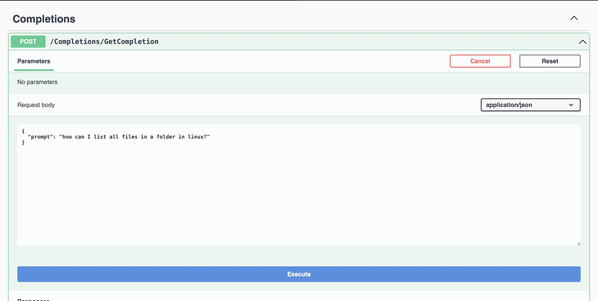
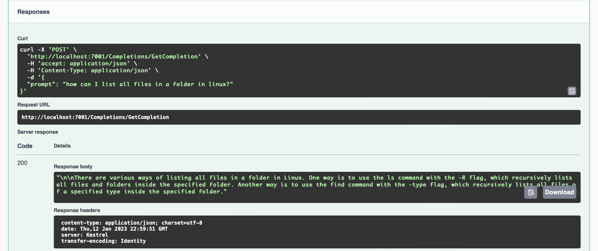

<!-- PROJECT LOGO -->
  <br />
    <p align="center">
    
  </a>
  <h1 align="center">NetGpt</h1>
  <p align="center">
    Experiments with OpenAi's GPT-3 using a .NET 7 API.
  </p>


# How To

Using a docker compose file:
> ⚠️ Remember to change the OpenAI API Key! ⚠️

``` YAML
version: "3.8"

services:
  api:
    image: ghcr.io/tiaringhio/netgpt:latest
    container_name: netgpt
    ports:
      - "7001:80"
    restart: always
    environment:
      - AppSettings__OpenApiUrl=https://api.openai.com/v1/completions
      - AppSettings__OpenApiKey=<YOUR-API-KEY-HERE>
      # Change value of API Key
```

Then simply go to http://localhost:7001/swagger/index.html and under the **Completions** controller click the **Try it out** button, write your prompt in the appropriate field and click the **Execute** button (blue button).

## Request Example

<p align="center">


## Response Example

<p align="center">


## Contributing

Contributions are what make the open source community such an amazing place to be learn, inspire, and create. Any contributions you make are **greatly appreciated**.

1. Fork the Project
2. Create your Feature Branch (`git checkout -b feature/AmazingFeature`)
3. Commit your Changes (`git commit -m 'Add some AmazingFeature'`)
4. Push to the Branch (`git push origin feature/AmazingFeature`)
5. Open a Pull Request

## Contributors

[Mattia Ricci](https://github.com/tiaringhio)